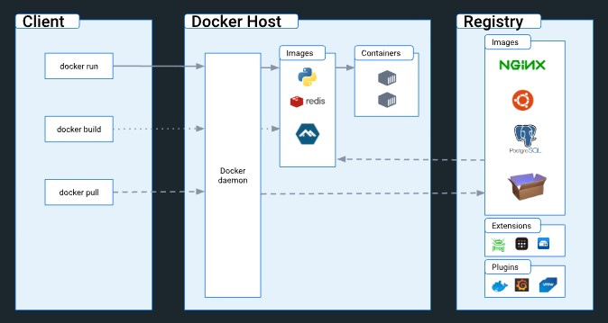

<h1><a name="readme-top"></a></h1>

[](https://github.com/marcossilvestrini/learning-docker/actions/workflows/powershell.yml)
[](https://github.com/marcossilvestrini/learning-docker/actions/workflows/release.yml)
[](https://github.com/marcossilvestrini/learning-docker/actions/workflows/check-docker-app.yml)

[![MIT License][license-shield]][license-url]
[![Forks][forks-shield]][forks-url]
[![Stargazers][stars-shield]][stars-url]
[![Contributors][contributors-shield]][contributors-url]
[![Issues][issues-shield]][issues-url]
[![LinkedIn][linkedin-shield]][linkedin-url]

# LEARNING Docker



<p align="center">
<strong>Explore the docs »</strong></a><br />
    <a href="https://marcossilvestrini.github.io/learning-docker/">Main Page</a>
    -
    <a href="https://github.com/marcossilvestrini/learning-docker">Code Page</a>
    -
    <a href="https://github.com/marcossilvestrini/learning-docker/issues">Report Bug</a>
    -
    <a href="https://github.com/marcossilvestrini/learning-docker/issues">Request Feature</a>
</p>

## Summary

<details>
  <summary><b>TABLE OF CONTENT</b></summary>
  <ol>
    <li>
      <a href="#about-the-project">About The Project</a>
    </li>
    <li>
      <a href="#getting-started">Getting Started</a>
      <ul>
        <li><a href="#prerequisites">Prerequisites</a></li>
        <li><a href="#installation">Installation</a></li>
      </ul>
    </li>
    <li><a href="#usage">Usage</a></li>
    <li><a href="#roadmap">Roadmap</a></li>
    <li><a href="#docker-containers">Docker Containers</a></li>
    <li><a href="#docker-images">Docker Images</a></li>
    <li><a href="#docker-build">Docker Build</a></li>
    <li><a href="#docker-volumes">Docker Volumes</a></li>
    <li><a href="#docker-network">Docker Network</a></li>
    <li><a href="#docker-compose">Docker Compose</a></li>
    <li><a href="#license">License</a></li>
    <li><a href="#contact">Contact</a></li>
    <li><a href="#acknowledgments">Acknowledgments</a></li>
  </ol>
</details><br>

<a name="about-the-project"></a>

## About Project

>This project aims to help students or professionals to learn the main concepts of Docker

<p align="right">(<a href="#readme-top">back to top</a>)</p>

<a name="getting-started"></a>

## Getting Started

This is an example of how you may give instructions on setting up your project locally.
To get a local copy up and running follow these simple example steps.

<a name="prerequisites"></a>

### Prerequisites

This is an example of how to list things you need to use the software
and how to install them.

* git
* Virtual Box and extension
* Vagrant

<a name="installation"></a>

### Installation

Clone the repo

```sh
git clone https://github.com/marcossilvestrini/learning-docker.git
```

<a name="usage"></a>

## Usage

Use this repository for get learning about Docker exam

<p align="right">(<a href="#readme-top">back to top</a>)</p>

<a name="roadmap"></a>

## Roadmap

* [x] Create repository
* [x] Create github action for automation tasks
* [x] Create examples about docker containers
* [x] Create examples about docker images

<p align="right">(<a href="#roadmap">back to roadmap</a>)</p>
<p align="right">(<a href="#readme-top">back to top</a>)</p>

>Docker Engine work with namespaces(PID,NET,IPC,MNT,UTS) and cgroups.

```sh
# Get a version of docker
docker --version
```

## Docker Containers

<a name="docker-containers"></a>

```sh
# list containers
docker container ls
docker ps

# list containers id
docker container ls -aq
docker ps -aq

# list containers virtual size
docker container ls -s

# create containers
docker container create -it ubuntu

# run container
docker run hello-world

# run container iterative
docker run -it <image_name> bash

# execute command in container
docker exec -it <container_id_or_name> <command>

# connect to docker container
docker container attach <CONTAINER ID>

# run container with name
docker run -it --name ubuntu01 ubuntu bash

# create container with specified network
docker run -it --name ubuntu01 --network skynet ubuntu bash

# create container with network host
docker run -it --name ubuntu01 --network host ubuntu bash

# start containers
docker container start ubuntu

# stop pause containers
docker stop <container_id_or_name>
docker stop -t=0 <container_id_or_name>

# Stop all containers
docker stop $(docker container ls -q)

# Pause\Unpause containers
docker pause <container_id_or_name>
docker unpause <container_id_or_name>

# delete container
docker rm <container_id_or_name> --force

# delete all containers
docker container rm $(docker container ls -aq) --force

# forwarding port
docker run -d -P <container_id_or_name>
docker run -d -p 8080:80 <container_id_or_name>

# show map ports
docker port <container_id_or_name>

# inspect container
docker inspect <container_id_or_name>

# show container resources usage information
docker container stat
docker container stats <container_id_or_name>

# show process in execution in container
docker container top <container_id_or_name>

# show container logs
docker container logs <container_id_or_name>
docker container logs -f <container_id_or_name>

# set limit of memory for container
docker container run -it -m 512M --name testmemory debian
docker container run -it --name testmemory2 --memory 1G debian

# set limit of cpu for container
docker container run -it --cpus=0.5 --name testcpu nginx

# update ram|cpu resource in container
docker container update -m 2048 testmemory
docker container update --cpus=3 testcpu

# get infos memory and cpu
docker inspect <container_id_or_name> | grep -i cpu
docker inspect <container_id_or_name> | grep -i mem
```

<p align="right">(<a href="#docker-containers">back to docker containers</a>)</p>
<p align="right">(<a href="#readme-top">back to top</a>)</p>

## Docker Images

<a name="docker-images"></a>

```sh
# pull image
docker pull <image_name>

# show local images images
docker images

# show details of images
docker inspect <image_id>

# show  details of images layers
docker history <image_id>

# remove docker images
docker rmi <image_id> --force

# remove all docker images
docker rmi $(docker images -aq) --force

# commit changes in container
## install and customize your container after...then:
docker commit -m "my container" CONTAINERID
docker tag IMAGEID marcossilvestrini/apache_2:1.0
```

## Docker Build

<a name="docker-build"></a>

Build a docker image

```sh
# first, create your Dockerfile with your app
```

```dockerfile
# Example Dockerfile
FROM debian
RUN /bin/echo "HELLO DOCKER"
```

```sh
# then create a docker image.
cd <path_of_your_dockerfile>
docker build -t <dockerhub_username/image_name:tag>

# publish your image in docker hub
docker push <dockerhub_username/image_name:tag>
```

<p align="right">(<a href="#docker-build">back to docker images</a>)</p>
<p align="right">(<a href="#readme-top">back to top</a>)</p>

## Docker Volumes

<a name="docker-volumes"></a>

```sh
# list docker volumes
docker volume ls

# inspect docker volumes
docker volume inspect <volume_name>

# find docker volumes
docker volume inspect --format '{{ .Mountpoint }}' <volume_name>


# create docker volume
docker volume create <volume_name>

# delete docker volume
docker volume rm <volume_name>

# delete all docker volume if not in user]
docker volume prune

# create container with docker bind mounts
docker run -d --mount type=bind,source=/myfolder-volume,target=/app <image_name_or_id>

# mount volumes
docker run -it -d -v <path_local_for_data>:<path_container_for_data> <image_name_or_id>
docker run -d -v <volume_name>:/app <image_name_or_id>

# mount file
docker container run -ti --mount type=bind,src=<path_local_for_data/file>,dst=<path_container_for_data/file> ubuntu

# share container volumes

##  create container volume
docker container create -v /data --name dbdata centos

## create containers
docker run -d -p 5432:5432 --name pgsql1 --volumes-from dbdata \
    -e POSTGRESQL_USER=docker -e POSTGRESQL_PASS=docker \
    -e POSTGRESQL_DB=docker kamui/postgresql

docker run -d -p 5433:5432 --name pgsql2 --volumes-from dbdata \
   -e POSTGRESQL_USER=docker -e POSTGRESQL_PASS=docker \
   -e POSTGRESQL_DB=docker kamui/postgresql

## find volume
docker inspect dbdata | grep -i Source

## list containers data of shared volume
sudo ls /var/lib/docker/volumes/<volume_id>/_data

# create backups of shared volume
docker run -ti --volumes-from dbdata -v $(pwd):/backup debian tar -cvf /backup/backup.tar /data
```

<p align="right">(<a href="#docker-volumes">back to docker volumes</a>)</p>
<p align="right">(<a href="#readme-top">back to top</a>)</p>

## Docker Network

<a name="docker-network"></a>

```sh
# list networks
docker network list

# inspect docker network
docker network inspect <network_name>

# create docker network bridge
docker network create --drive bridge <network_name>

# delete docker network
docker network rm <network_name>
```

<p align="right">(<a href="#docker-network">back to docker network</a>)</p>
<p align="right">(<a href="#readme-top">back to top</a>)</p>

## Docker Compose

<a name="docker-compose"></a>

```sh
# list containers|services
docker-compose ps
docker-compose -f configs/docker/apps/app-silvestrini/docker-compose.yaml  ps

# create containers|services
docker-compose up
docker-compose up -d
docker-compose -f configs/docker/apps/app-silvestrini/docker-compose.yaml up
```

<p align="right">(<a href="#docker-compose">back to docker composed</a>)</p>
<p align="right">(<a href="#readme-top">back to top</a>)</p>

## Contributing

Contributions are what make the open source community such an amazing place to
learn, inspire, and create. Any contributions you make are **greatly appreciated**.

If you have a suggestion that would make this better, please fork the repo and
create a pull request. You can also simply open an issue with the tag "enhancement".
Don't forget to give the project a star! Thanks again!

1. Fork the Project
2. Create your Feature Branch (`git checkout -b feature/AmazingFeature`)
3. Commit your Changes (`git commit -m 'Add some AmazingFeature'`)
4. Push to the Branch (`git push origin feature/AmazingFeature`)
5. Open a Pull Request

## License

* This project is licensed under the MIT License * see the LICENSE.md file for details

## Contact

Marcos Silvestrini - marcos.silvestrini@gmail.com \
[](https://twitter.com/mrsilvestrini)

Project Link: [https://github.com/marcossilvestrini/learning-docker](https://github.com/marcossilvestrini/learning-docker)

<p align="right">(<a href="#readme-top">back to top</a>)</p>

## Acknowledgments

* [Docker Website](https://www.docker.com/)
* [Docker Overview](https://docs.docker.com/get-started/overview/)
* [Convert Command in Dockerfile](https://www.composerize.com/)
* [Deploy Docker Register](https://docs.docker.com/registry/deploying/)

<p align="right">(<a href="#readme-top">back to top</a>)</p>

<!-- MARKDOWN LINKS & IMAGES-->
<!-- https://www.markdownguide.org/basic-syntax/#reference-style-links -->
[contributors-shield]: https://img.shields.io/github/contributors/marcossilvestrini/learning-docker.svg?style=for-the-badge
[contributors-url]: https://github.com/marcossilvestrini/learning-docker/graphs/contributors
[forks-shield]: https://img.shields.io/github/forks/marcossilvestrini/learning-docker.svg?style=for-the-badge
[forks-url]: https://github.com/marcossilvestrini/learning-docker/network/members
[stars-shield]: https://img.shields.io/github/stars/marcossilvestrini/learning-docker.svg?style=for-the-badge
[stars-url]: https://github.com/marcossilvestrini/learning-docker/stargazers
[issues-shield]: https://img.shields.io/github/issues/marcossilvestrini/learning-docker.svg?style=for-the-badge
[issues-url]: https://github.com/marcossilvestrini/learning-docker/issues
[license-shield]: https://img.shields.io/github/license/marcossilvestrini/learning-docker.svg?style=for-the-badge
[license-url]: https://github.com/marcossilvestrini/learning-docker/blob/master/LICENSE
[linkedin-shield]: https://img.shields.io/badge/-LinkedIn-black.svg?style=for-the-badge&logo=linkedin&colorB=555
[linkedin-url]: https://linkedin.com/in/marcossilvestrini
